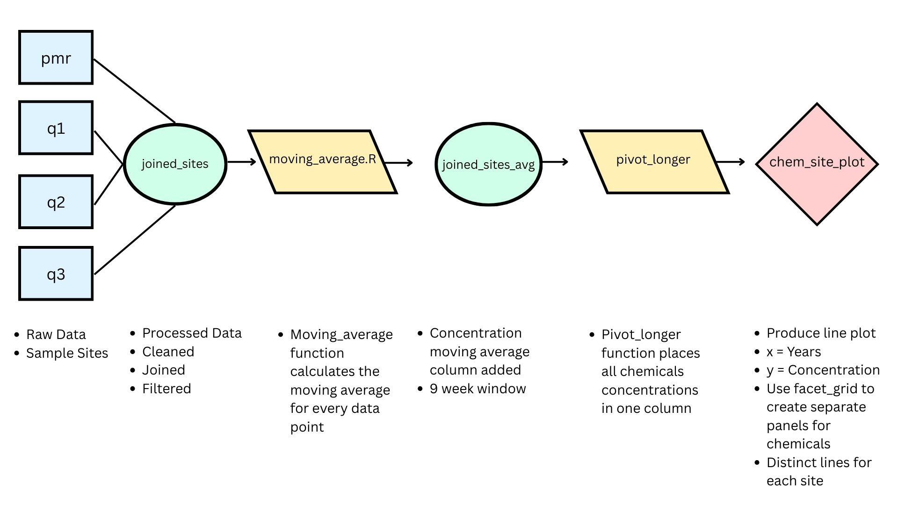

# Hurricane Hugo's Impact on Stream Chemical Concentration

### Author: Richard Montes Lemus

#### 2025-08-29

The purpose of this repository is to reproduce figure 3 from Douglas A. Schaefer et al.

It plots the 9 week moving average concentration of Ammonium Nitrogen, Calcium, Magnesium, Nitrate, and Potassium, from 4 sites within the Bisley watershed in the Luquillo Mountains, Puerto Rico before and after Hurricane Hugo. 

{width=900}

## Data
### /data:
- Contains raw csv files obtained from [EDI Data     Portal](https://portal.edirepository.org/nis/metadataviewer?packageid=knb-lter-luq.20.4923064). 

## Analysis script
### /paper:
- Contains a quarto document (paper.qmd) that completes the entire analysis with rendering. 

## Supporting code
### /R:
- Contains a function that replaces default axis titles for the facet grid's strips with new names (chemical_labeller.R). 
- Contains a function that calculates the moving mean across 9 weeks for every data point (moving_average.R). 

### /Scratch:
- Contains spaghetti script which was used to brainstorm the code needed to produce the desired plot.
### root: 
- Contains R script "1_df_clean_wrang.R", which cleans, joins, and filters the raw data.

## outputs
### /outputs:
- Contains an rds file called "joined_sites.rds", which is the output of the "1_df_clean_wrang.R" script. 
### /figs:
- Contains a .png file of the final plot (chem_site_plot). 
### /docs:
- Contains an html file used to produce a github page for the quarto document. 

## References

McDowell, William H., and USDA Forest Service. International Institute Of Tropical Forestry (IITF). 2024. “Chemistry of Stream Water from the Luquillo Mountains.” Environmental Data Initiative. <https://doi.org/10.6073/PASTA/F31349BEBDC304F758718F4798D25458>.

Schaefer, Douglas. A., William H. McDowell, Fredrick N. Scatena, and Clyde E. Asbury. 2000. “Effects of Hurricane Disturbance on Stream Water Concentrations and Fluxes in Eight Tropical Forest Watersheds of the Luquillo Experimental Forest, Puerto Rico.” Journal of Tropical Ecology 16 (2): 189–207. <https://doi.org/10.1017/s0266467400001358>.

## Contact Information 
richard.montes.lemus@gmail.com
